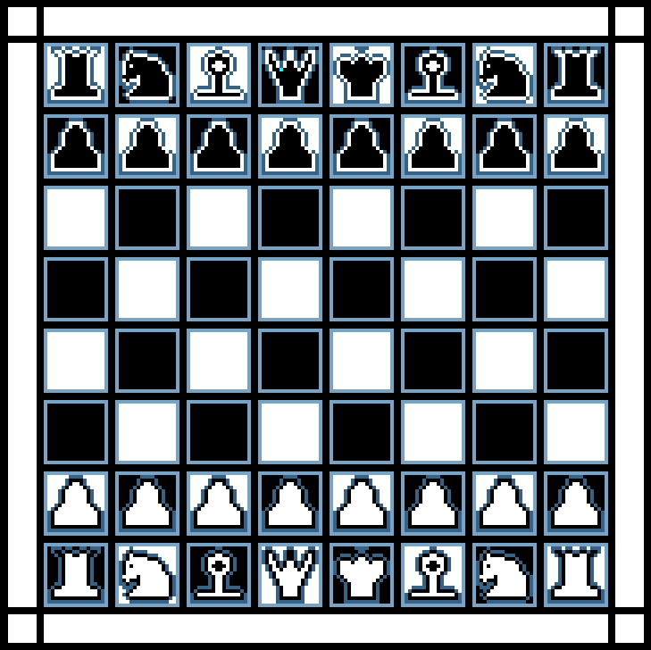

# DOS Chess

This repo contains code and executable for a chess game written for DOS in 80x86 assembly.

The game is able to show valid moves and detect a checkmate.

## Limitations

- No castling
- No pawn promotion
- No en passant

#

